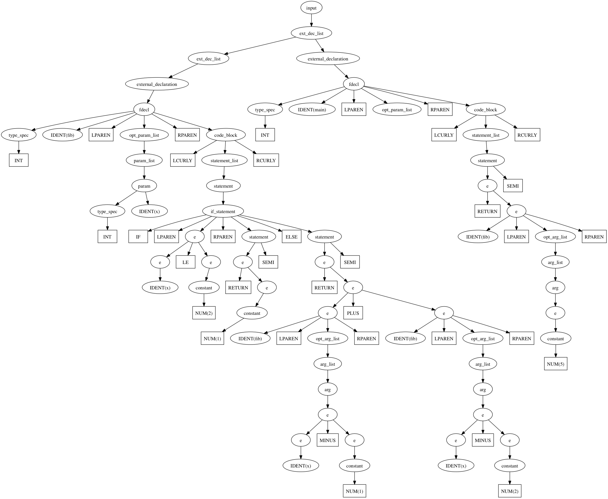

# Fibonacci Example

Source Code (`test/data/fib.c`)

    int fib(int x) {
      if (x < 2) return 1;
      else return fib(x-1)+fib(x-2);
    }

    int main() {
      return fib(5);
    }

Parse Tree

