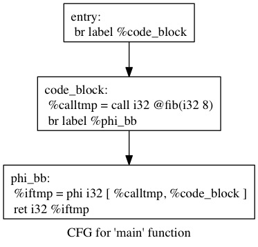
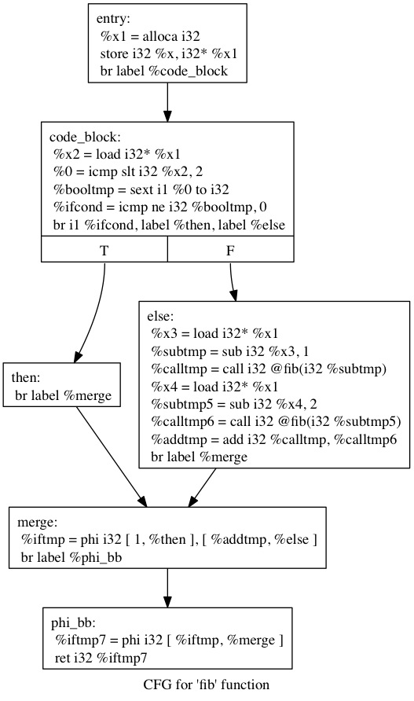

# Recursive Fibonacci Example

## Source Code (`test/data/fib.c`)

    int fib(int x) {
      if (x < 2) return 1;
      else return fib(x-1)+fib(x-2);
    }

    int main() {
      return fib(5);
    }

## Command

    oryx -v fib.c -o fib.out

## Tokens
File: `fib.lex`

    TYPE   |  VALUE   |  POSITION
    -----------------------------------
    INT                       1,0
    IDENT        fib          1,4
    LPAREN                    1,7
    INT                       1,8
    IDENT         x          1,12
    RPAREN                   1,13
    LCURLY                   1,15
    IF                        2,2
    LPAREN                    2,5
    IDENT         x           2,6
    LE                        2,8
    NUM           2          2,10
    RPAREN                   2,11
    RETURN                   2,13
    NUM           1          2,20
    SEMI                     2,21
    ELSE                      3,2
    RETURN                    3,7
    IDENT        fib         3,14
    LPAREN                   3,17
    IDENT         x          3,18
    MINUS                    3,19
    NUM           1          3,20
    RPAREN                   3,21
    PLUS                     3,22
    IDENT        fib         3,23
    LPAREN                   3,26
    IDENT         x          3,27
    MINUS                    3,28
    NUM           2          3,29
    RPAREN                   3,30
    SEMI                     3,31
    RCURLY                    4,0
    INT                       6,0
    IDENT        main         6,4
    LPAREN                    6,8
    RPAREN                    6,9
    LCURLY                   6,11
    RETURN                    7,2
    IDENT        fib          7,9
    LPAREN                   7,12
    NUM           8          7,13
    RPAREN                   7,14
    SEMI                     7,15
    RCURLY                    8,0
    EOS

## Parse Tree
Files: `fib.dot`, `fib.jpg`

Command: `dot -Tjpeg fib.dot -o fib.jpg`

## LLVM IR

File: `fib.ll`

    ; ModuleID = 'Oryx JIT'

    define i32 @fib(i32 %x) {
    entry:
      %x1 = alloca i32
      store i32 %x, i32* %x1
      br label %code_block

    code_block:                                       ; preds = %entry
      %x2 = load i32* %x1
      %0 = icmp slt i32 %x2, 2
      %booltmp = sext i1 %0 to i32
      %ifcond = icmp ne i32 %booltmp, 0
      br i1 %ifcond, label %then, label %else

    then:                                             ; preds = %code_block
      br label %merge

    else:                                             ; preds = %code_block
      %x3 = load i32* %x1
      %subtmp = sub i32 %x3, 1
      %calltmp = call i32 @fib(i32 %subtmp)
      %x4 = load i32* %x1
      %subtmp5 = sub i32 %x4, 2
      %calltmp6 = call i32 @fib(i32 %subtmp5)
      %addtmp = add i32 %calltmp, %calltmp6
      br label %merge

    merge:                                            ; preds = %else, %then
      %iftmp = phi i32 [ 1, %then ], [ %addtmp, %else ]
      br label %phi_bb

    phi_bb:                                           ; preds = %merge
      %iftmp7 = phi i32 [ %iftmp, %merge ]
      ret i32 %iftmp7
    }

    define i32 @main() {
    entry:
      br label %code_block

    code_block:                                       ; preds = %entry
      %calltmp = call i32 @fib(i32 8)
      br label %phi_bb

    phi_bb:                                           ; preds = %code_block
      %iftmp = phi i32 [ %calltmp, %code_block ]
      ret i32 %iftmp
    }

## x86
File: `fib.s`

            .section	__TEXT,__text,regular,pure_instructions
            .globl	_fib
            .align	4, 0x90
    _fib:                                   ## @fib
    Ltmp2:
    ## BB#0:                                ## %entry
            pushq	%rbx
    Ltmp3:
            subq	$16, %rsp
    Ltmp4:
    Ltmp5:
            movl	%edi, 12(%rsp)
            movl	$-1, %eax
            cmpl	$2, 12(%rsp)
            movl	$0, %ecx
            cmovll	%eax, %ecx
            movl	$1, %eax
            testl	%ecx, %ecx
            jne	LBB0_2
    ## BB#1:                                ## %else
            movl	12(%rsp), %edi
            decl	%edi
            callq	_fib
            movl	%eax, %ebx
            movl	12(%rsp), %edi
            addl	$-2, %edi
            callq	_fib
            addl	%ebx, %eax
    LBB0_2:                                 ## %phi_bb
            addq	$16, %rsp
            popq	%rbx
            ret
    Ltmp6:
    Leh_func_end0:

            .globl	_main
            .align	4, 0x90
    _main:                                  ## @main
    Ltmp8:
    ## BB#0:                                ## %entry
            pushq	%rax
    Ltmp9:
            movl	$8, %edi
            callq	_fib
            popq	%rdx
            ret
    Ltmp10:
    Leh_func_end1:

    .subsections_via_symbols
            .section	__TEXT,__eh_frame,coalesced,no_toc+strip_static_syms+live_support
    Ltmp11:
    EH_frame0:
    Ltmp13 = (Ltmp12-EH_frame0)-4           ## CIE Length
            .long	Ltmp13
            .long	0                       ## CIE ID Tag
            .byte	1                       ## DW_CIE_VERSION
            .ascii	 "zR"                   ## CIE Augmentation
            .byte	0
            .byte	1                       ## CIE Code Alignment Factor
            .byte	120                     ## CIE Data Alignment Factor
            .byte	16                      ## CIE Return Address Column
            .byte	1                       ## Augmentation Size
            .byte	16                      ## FDE Encoding = indirect pcrel sdata8
            .byte	12                      ## DW_CFA_def_cfa
            .byte	7                       ## Reg 7
            .byte	8                       ## Offset 8
            .byte	144                     ## DW_CFA_offset + Reg(16)
            .byte	1                       ## Offset 1
            .align	2
    Ltmp12:
            .globl	_fib.eh
    _fib.eh:
    Ltmp16 = (Ltmp15-Ltmp14)-0              ## FDE Length
            .long	Ltmp16
    Ltmp14:
    Ltmp17 = (Ltmp14-EH_frame0)-0           ## FDE CIE Offset
            .long	Ltmp17
    Ltmp18:
    Ltmp19 = Ltmp2-Ltmp18                   ## FDE initial location
            .quad	Ltmp19
    Ltmp20 = (Ltmp6-Ltmp2)-0                ## FDE address range
            .quad	Ltmp20
            .byte	0                       ## Augmentation size
            .byte	4                       ## DW_CFA_advance_loc4
    Ltmp21 = Ltmp3-Ltmp2
            .long	Ltmp21
            .byte	14                      ## DW_CFA_def_cfa_offset
            .byte	16                      ## Offset 16
            .byte	4                       ## DW_CFA_advance_loc4
    Ltmp22 = Ltmp4-Ltmp3
            .long	Ltmp22
            .byte	14                      ## DW_CFA_def_cfa_offset
            .byte	32                      ## Offset 32
            .byte	4                       ## DW_CFA_advance_loc4
    Ltmp23 = Ltmp5-Ltmp4
            .long	Ltmp23
            .byte	131                     ## DW_CFA_offset + Reg(3)
            .byte	2                       ## Offset 2
            .align	3
    Ltmp15:
            .globl	_main.eh
    _main.eh:
    Ltmp26 = (Ltmp25-Ltmp24)-0              ## FDE Length
            .long	Ltmp26
    Ltmp24:
    Ltmp27 = (Ltmp24-EH_frame0)-0           ## FDE CIE Offset
            .long	Ltmp27
    Ltmp28:
    Ltmp29 = Ltmp8-Ltmp28                   ## FDE initial location
            .quad	Ltmp29
    Ltmp30 = (Ltmp10-Ltmp8)-0               ## FDE address range
            .quad	Ltmp30
            .byte	0                       ## Augmentation size
            .byte	4                       ## DW_CFA_advance_loc4
    Ltmp31 = Ltmp9-Ltmp8
            .long	Ltmp31
            .byte	14                      ## DW_CFA_def_cfa_offset
            .byte	16                      ## Offset 16
            .align	3
            .align	3
    Ltmp25:

## Return Value

    $ echo $?
    34

